# 🔴 API Data Fetcher with Local Cache

### Flutter Assignment 8

A Flutter application that fetches posts from a public REST API, displays them using `FutureBuilder`, and stores the latest successful result locally using `SharedPreferences`.

---

## 📌 Project Overview

This project was created for **Flutter Assignment 8: API Data Fetcher with Local Cache**.

The application demonstrates a complete API workflow inside Flutter:

- Send an HTTP GET request.
- Receive JSON data from the REST API.
- Convert JSON into Dart model objects.
- Display the data in a Flutter dashboard.
- Manage the asynchronous request with `FutureBuilder`.
- Save the latest successful result using `SharedPreferences`.
- Use cached data when the API request is unavailable.
- Provide refresh and pull-to-refresh actions.

The project uses the **JSONPlaceholder** public API and the `/posts` endpoint.

---

## 🎯 Assignment Objective

The main objective of this assignment is to understand how a Flutter application can work with remote API data and local storage at the same time.

The application covers the following required concepts:

1. Public REST API integration
2. HTTP GET request
3. JSON parsing
4. Dart data model
5. `FutureBuilder`
6. Loading state
7. Success state
8. Error state
9. `SharedPreferences`
10. Local cache fallback
11. Refresh functionality

---

## ✨ Features

- 🌐 REST API integration
- ⚡ Asynchronous data fetching
- 🧩 JSON to Dart model conversion
- 🧱 `FutureBuilder` based UI
- 💾 Local caching with `SharedPreferences`
- 📴 Cached-data fallback
- 🔄 Refresh button
- 👆 Pull-to-refresh
- ⚠️ Error handling
- 📱 Responsive Flutter layout
- 🎨 Black and red dashboard theme
- 📊 API information section
- 📝 Post cards with title and body
- 🔴 LIVE and CACHED status indicators

---

## 🌐 REST API Used

**API:** JSONPlaceholder  
**Method:** `GET`  
**Endpoint:** `/posts`  
**Response:** JSON  
**Available Records:** 100 posts  
**Fields:** `userId`, `id`, `title`, `body`

API URL:

https://jsonplaceholder.typicode.com/posts

JSONPlaceholder is used as the public data source for this assignment.

---

## 📦 Sample API Response

```json
{
  "userId": 1,
  "id": 1,
  "title": "sunt aut facere repellat provident occaecati excepturi optio reprehenderit",
  "body": "quia et suscipit suscipit recusandae consequuntur expedita et cum"
}
```

The response contains multiple post objects.

Each post contains:

- `userId`
- `id`
- `title`
- `body`

---

## 🧠 Application Flow

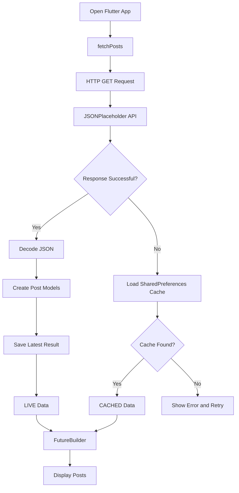

The basic flow is:

**Fetch → Parse → Display → Cache → Reuse**

---

## ⚡ FutureBuilder

`FutureBuilder` is used to connect the asynchronous API request with the Flutter interface.

The API request does not complete immediately, so the screen needs to react to different states while waiting for the result.

### Main states used in the app

- **Waiting:** show loading UI.
- **Success:** show the returned posts.
- **Error:** try local cache and show an error when no cache is available.

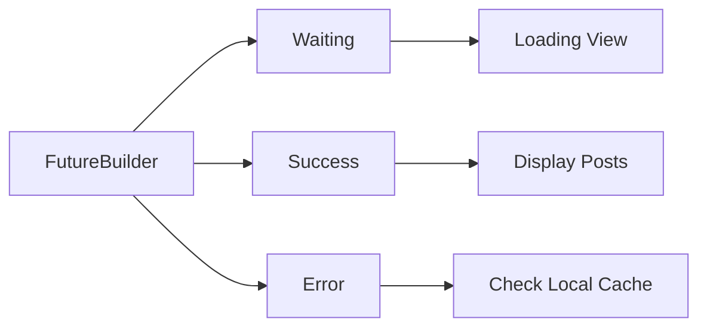

---

## ⏳ Loading State

While the request is running, the application shows a loading indicator.

This gives the user immediate feedback that the app is working and waiting for the API response.

---

## ✅ Success State

When the API request succeeds:

1. The JSON response is decoded.
2. A list of `Post` objects is created.
3. The latest result is saved locally.
4. The UI displays the posts.
5. The dashboard shows the current data as **LIVE**.

The app keeps the latest successful result so it can be reused later.

---

## ❌ Error State

When the API request fails, the application does not immediately stop at an error.

Instead, it checks `SharedPreferences` for the latest saved result.

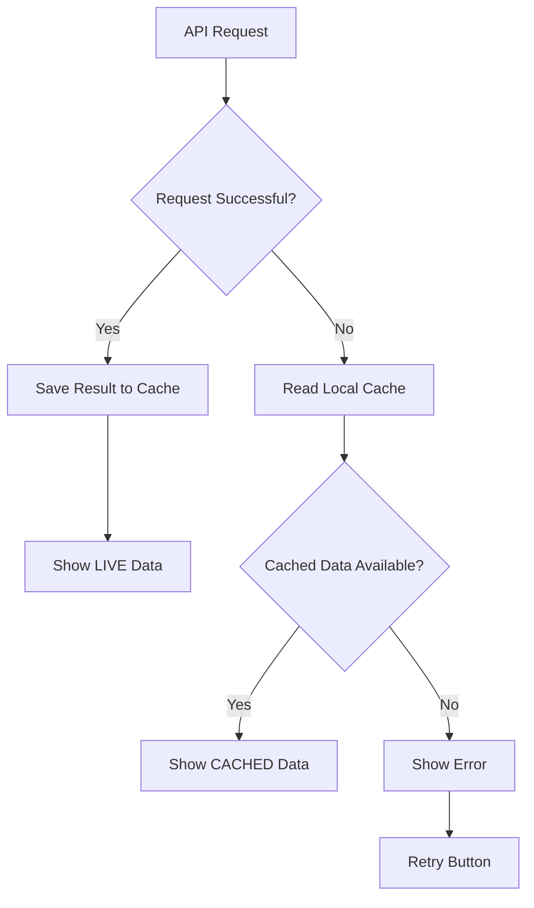

---

## 💾 Local Cache

`SharedPreferences` is used for simple local storage.

Flutter objects cannot be stored directly as custom objects in `SharedPreferences`, so the project converts the post data into JSON strings before saving it.

### Cache process

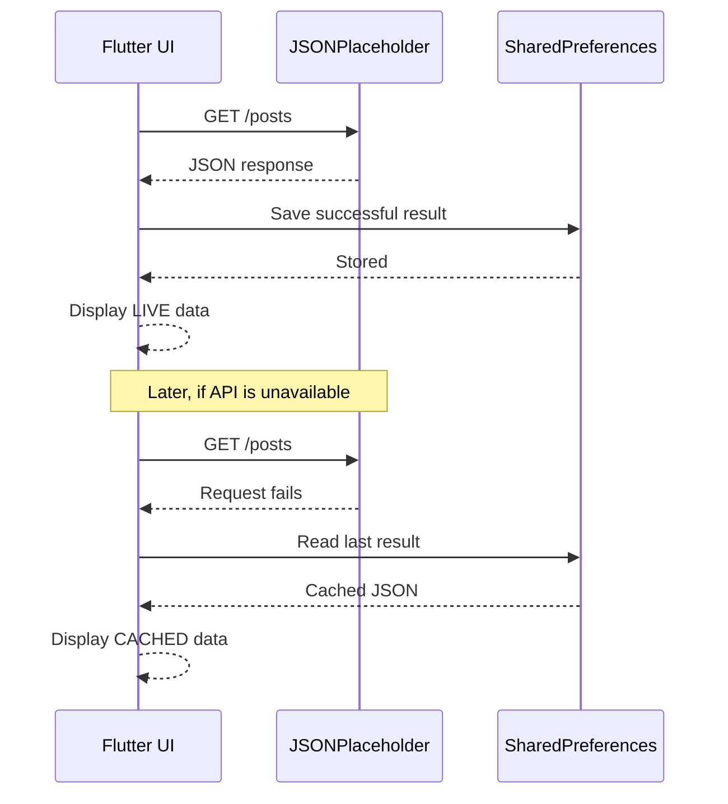

---

## 🔴 LIVE Data

**LIVE** means the current request returned data successfully from the REST API.

The result is also written to local storage so it can be used as a fallback during a later request.

---

## 🟠 CACHED Data

**CACHED** means the API request was not successful, so the app loaded the latest successful result stored on the device.

This gives the application a simple offline fallback for previously fetched data.

---

## 🔁 Complete Data Flow

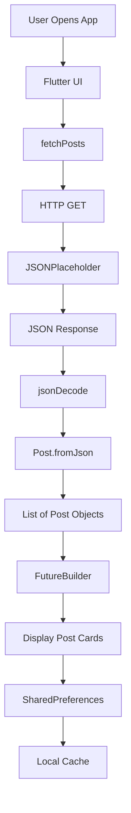

---

## 🧩 Post Model

The application uses a Dart `Post` model to represent API data.

### Properties

```text
userId
id
title
body
```

### Model responsibilities

`fromJson()` converts a JSON map into a Dart `Post` object.

`toJson()` converts a Dart `Post` object back into JSON so it can be saved in the local cache.

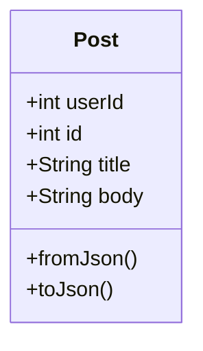

---

## 🛠️ Technologies Used

| Technology | Purpose |
|---|---|
| Flutter | App development framework |
| Dart | Programming language |
| HTTP | REST API communication |
| SharedPreferences | Local cache storage |
| JSONPlaceholder | Public REST API |
| FutureBuilder | Async UI handling |
| RefreshIndicator | Pull-to-refresh |
| VS Code | Development environment |
| Git | Version control |
| GitHub | Source code hosting |

---

## 📦 Dependencies

```yaml
dependencies:
  flutter:
    sdk: flutter
  http:
  shared_preferences:
```

Packages were added using:

```bash
flutter pub add http
flutter pub add shared_preferences
```

---

## 🎨 UI Design

The application uses a dark developer-dashboard style with a black and red visual theme.

### Color Palette

| Element | Color |
|---|---|
| Background | `#0B0B0B` |
| Cards | `#151515` |
| Primary Red | `#E50914` |
| Secondary Red | `#FF3B3B` |
| Main Text | White |
| Secondary Text | `#999999` |
| Borders | `#292929` |

The dark background keeps the dashboard simple, while red is used for actions, labels, and important status information.

---

## 🖥️ Dashboard Sections

The screen contains:

1. Application title
2. Dashboard subtitle
3. LIVE / CACHED status
4. API Information card
5. HTTP method
6. Endpoint
7. Response type
8. Available records
9. Local storage information
10. Posts section
11. Refresh action

---

## 📊 API Information Shown in the UI

| Field | Value |
|---|---|
| API | JSONPlaceholder |
| Method | GET |
| Endpoint | `/posts` |
| Response | JSON |
| Available Records | 100 Posts |
| Local Storage | SharedPreferences |

The API provides 100 posts. The dashboard displays the first 10 posts so the page remains clean and easy to read.

---

## 🔄 Refresh Function

The project supports two refresh methods.

### Refresh button

The refresh button sends a new API request without restarting the app.

### Pull-to-refresh

`RefreshIndicator` is used so the user can pull the post list downward to request updated data.

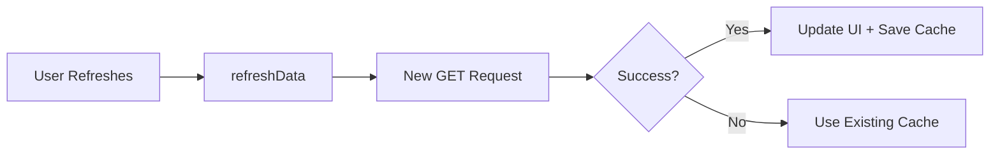

---

## 🧪 Testing

The main assignment requirements were tested during development.

| Test | Expected Result | Status |
|---|---|---|
| Launch application | Dashboard opens | ✅ Passed |
| API request | Posts are fetched | ✅ Passed |
| JSON parsing | JSON becomes `Post` objects | ✅ Passed |
| FutureBuilder | Loading and success states work | ✅ Passed |
| Cache save | Successful result is stored | ✅ Passed |
| Cache fallback | Cached result appears when API fails | ✅ Passed |
| Refresh | A new request is made | ✅ Passed |
| Error handling | Error and retry are shown when no data exists | ✅ Passed |

---

## 🛡️ Error Handling Flow

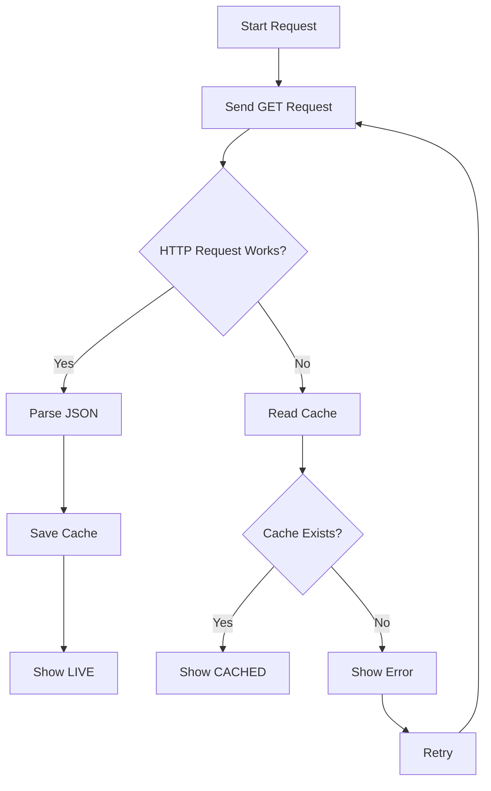

---

## 📂 Project Structure

```text
assignment_8/
│
├── android/
├── ios/
├── lib/
│   └── main.dart
├── linux/
├── macos/
├── test/
├── web/
├── windows/
├── pubspec.yaml
├── pubspec.lock
└── README.md
```

---

## 📄 Main File

Most of the assignment logic is kept in `lib/main.dart`.

The file contains:

- App configuration
- API request function
- Cache save function
- Cache load function
- Refresh logic
- `FutureBuilder`
- Loading UI
- Error UI
- API information cards
- Post cards
- `Post` model

Keeping the assignment logic together also makes the project easier to understand during a practical viva.

---

## 🚀 Getting Started

### Step 1 — Check Flutter

```bash
flutter doctor
```

### Step 2 — Clone the repository

```bash
git clone https://github.com/Nupurbhoir/FLUTTER-Assignment-8-API-Data-Fetcher-with-Local-Cache.git
```

### Step 3 — Open the project

```bash
cd FLUTTER-Assignment-8-API-Data-Fetcher-with-Local-Cache
```

### Step 4 — Install dependencies

```bash
flutter pub get
```

### Step 5 — Run on Chrome

```bash
flutter run -d chrome
```

### Step 6 — Run on a connected device

```bash
flutter run
```

---

## 💻 Development Environment

The project was developed using:

- macOS
- VS Code
- Flutter
- Dart
- Chrome
- Git
- GitHub

---

## 🧠 Problems Faced and Solutions

### Problem 1 — Wrong project directory

The Flutter package command was initially run from the outer folder instead of the actual Flutter project root.

**Solution:** move into the folder containing `pubspec.yaml` before running Flutter commands.

### Problem 2 — API data is asynchronous

The interface cannot assume that the API response is available immediately.

**Solution:** use `FutureBuilder` to manage the waiting, success, and error states.

### Problem 3 — Saving custom Dart objects

`SharedPreferences` does not directly store custom Dart objects.

**Solution:** convert post objects into JSON strings before saving them.

### Problem 4 — API request can fail

A temporary network problem can make the remote request unavailable.

**Solution:** read the latest successful result from the local cache.

### Problem 5 — Showing too much API data

The API returns many records, which can make a dashboard unnecessarily long.

**Solution:** keep the information card clear and display the first 10 posts while showing that the API provides 100 posts.

---

## 📚 What I Learned

Through this assignment, I learned how a Flutter application communicates with a REST API and handles the returned data.

I practiced:

- Sending HTTP GET requests
- Working with JSON
- Creating model classes
- Using `FutureBuilder`
- Handling asynchronous operations
- Creating loading and error states
- Using `SharedPreferences`
- Building a local cache
- Reusing cached data after an API failure
- Implementing refresh behavior
- Designing a simple dashboard UI

---

## 🔑 Key Concepts

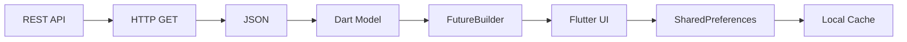

---

## 🏗️ Application Architecture

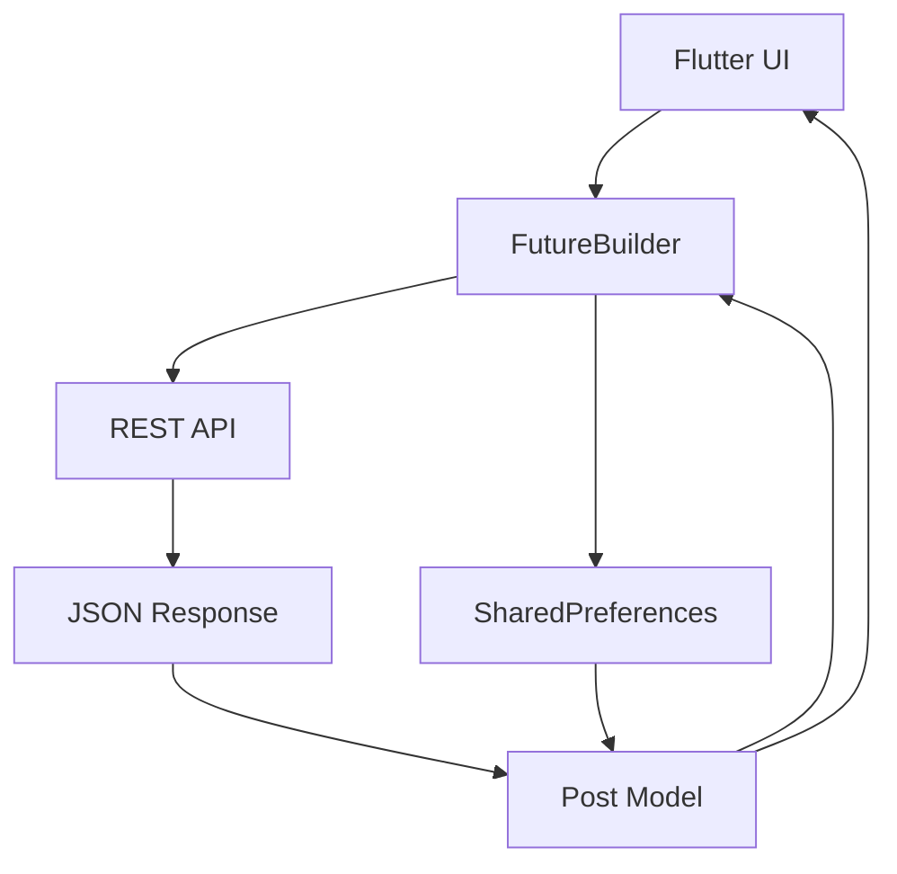

The architecture is intentionally simple for this assignment. The app has a UI layer, API request flow, model conversion, and local cache fallback.

---

## 🔗 GitHub Repository

The complete project is available here:

https://github.com/Nupurbhoir/FLUTTER-Assignment-8-API-Data-Fetcher-with-Local-Cache

---

## 👩‍💻 Author

**Nupur Bhoir**  
B.Tech Computer Science Engineering  
ITM Skills University

---

## 🎓 Assignment Details

| Item | Details |
|---|---|
| Assignment | 8 |
| Topic | API Data Fetcher with Local Cache |
| Framework | Flutter |
| Language | Dart |
| API | JSONPlaceholder |
| Storage | SharedPreferences |
| Async UI | FutureBuilder |

---

## 📌 Original Requirement

> Fetch data from a public REST API, such as JSONPlaceholder, display it with `FutureBuilder`, and cache the last result using `SharedPreferences`.

This project implements that requirement through a working Flutter dashboard with API fetching, JSON parsing, local caching, refresh support, and error handling.

---

## ⭐ Final Project Summary

The project demonstrates a complete flow from remote data to local fallback.

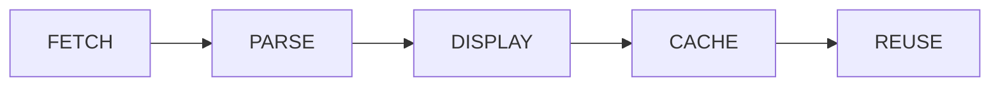

### Final workflow

**Fetch → Parse → Display → Cache → Reuse**

The assignment brings together REST API integration, JSON parsing, asynchronous programming, `FutureBuilder`, `SharedPreferences`, caching, error handling, refresh functionality, and Flutter UI design.

---

## 📝 Notes for Viva

### What is a REST API?

A REST API allows an application to communicate with a server using HTTP methods such as GET, POST, PUT, and DELETE.

### Why is GET used here?

The project only needs to retrieve data from JSONPlaceholder, so an HTTP GET request is appropriate.

### Why use FutureBuilder?

The API request is asynchronous. `FutureBuilder` lets the UI respond to the current state of that asynchronous operation.

### Why use SharedPreferences?

It provides simple key-value local storage suitable for saving the latest cached result required by this assignment.

### What happens when the API fails?

The app checks for previously stored posts. When cached data exists, it displays the cached result instead of leaving the user with an empty screen.

### Why convert objects to JSON before caching?

The `Post` model is a Dart object, while the cache stores simple values. Converting the object to JSON makes the data easy to store and recreate later.

---

## 🔍 Important Code Concepts

### API request

```dart
final response = await http.get(Uri.parse(url));
```

### Decode JSON

```dart
final data = jsonDecode(response.body);
```

### Build model objects

```dart
Post.fromJson(item)
```

### Store cache

```dart
await prefs.setStringList('cached_posts', encodedData);
```

### FutureBuilder

```dart
FutureBuilder<List<Post>>(
  future: futurePosts,
  builder: (context, snapshot) {
    // UI state handling
  },
)
```

These pieces form the main technical workflow of the application.

---

## ✅ Assignment Checklist

- [x] Flutter project created
- [x] Public REST API used
- [x] GET request implemented
- [x] JSON response handled
- [x] Dart model created
- [x] `FutureBuilder` used
- [x] Loading state implemented
- [x] Error state implemented
- [x] `SharedPreferences` added
- [x] Successful API data cached
- [x] Cached fallback implemented
- [x] Refresh action implemented
- [x] Pull-to-refresh implemented
- [x] Responsive dashboard UI created
- [x] GitHub repository updated
- [x] README documentation added

---

## 🏁 Conclusion

API Data Fetcher successfully demonstrates the main requirements of Flutter Assignment 8.

The application fetches post data from JSONPlaceholder, parses the JSON response into Dart objects, displays the information with `FutureBuilder`, and stores the latest successful result using `SharedPreferences`.

When the API request is unavailable, previously cached data can be displayed. This makes the assignment a practical example of combining remote data fetching with simple local storage.

---

## ❤️ Final Result

```text
      REST API
          ↓
      HTTP GET
          ↓
      JSON DATA
          ↓
     POST MODEL
          ↓
    FUTUREBUILDER
          ↓
      FLUTTER UI
          ↓
   SHARED PREFERENCES
          ↓
      LOCAL CACHE
          ↓
   FALLBACK DATA
```

**Fetch → Parse → Display → Cache → Reuse**

Made with Flutter ❤️  
**Assignment 8 — Nupur Bhoir**
